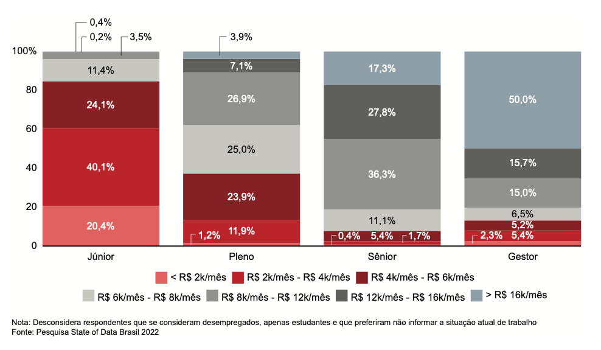

# State of Data Brazil 2022 - Análise Exploratória de Dados: Descobrindo Tendências no Mercado de Dados

## 💡Contexto
O **State of Data Brazil** ([link](https://www.bain.com/contentassets/16494c60fcd045188615f05e728385b3/state-of-data2022_um-raio-x-dos-profissionais-de-dados-do-brasil.pdf)), realizada pelo [Data Hackers](https://www.datahackers.com.br/) e pela [Bain & Company](https://www.bain.com/), é uma das
maiores pesquisas sobre o mercado brasileiro de dados. Dentre os assuntos pesquisado na
última pesquisa (2022), foi mapeado o peral atual das três maiores proassões da área de
dados do Brasil: **engenheiro de dados**, **cientista de dados** e **analista de dados**. O relatório
completo pode ser acessado neste [link](https://www.stateofdata.com.br/).

###### Imagem 1: Remuneração em 2022 por nível de cargo

## 🖥️Objetivo
O objetivo principal deste projeto é identificar e analisar a média de salários no mercado de dados, levando em consideração os cargos (Analista, Cientista e Engenheiro de Dados) e seus níveis de experiência. Por meio desta análise, descobrir tendências significativas e insights valiosos que possam auxiliar profissionais, empresas e pesquisadores no entendimento do panorama salarial neste campo em constante evolução.

##  🗂️Estrutura de Arquivos no Repositório:
* Notebooks: 
    - notebook_analise_exploratoria.ipynb
        - Que contêm códigos de leitura, limpeza, gráficos e insights relacionados à análise e exploração de dados.
    
    - notebook_storytelling.ipynb
        - Que contêm o storytelling apresentando os dados com uma narrativa contextual

* CSV
    - State_of_data_2022: dados da pesquisa disponibilizados no site do Kaggle
    - data.csv: arquivo de checkpoint após execução das operações com os dados de tranformação inicial
    - data_upd.csv: arquivo resultante após aplicação final das transformações, pronto para ser utilizado na geração de insights."

## 🔍Referências
- [Alura](https://www.alura.com.br/)